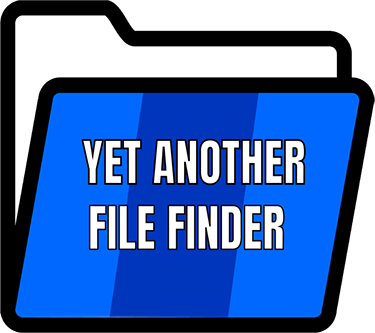

# Yet Another File Finder

   

## Introduction

YAFF ou Yet Another File Finder est une application permettant à un utilisateur de rechercher un fichier dans un dossier et dans les sous-dossiers de ce dernier. La complexité de l’application est qu’elle est capable de lire dans les fichiers pour savoir si dans le fichier \(qui est lue par l’application\), le mot recherché est contenu. L’utilisateur a la possibilité de sélectionner le dossier ou le disque dur. Il a aussi la possibilité avant ou après la recherche d’un fichier de soit ouvrir son répertoire ou soit d’ouvrir le fichier directement en le sélectionnant.

Cette application a été réalisé suite à la demande de Mr. Jérôme Chevillat qui est venu nous présenter le cahier des charges du projet.

Pour ce projet, nous étions une équipe de deux techniciens en développement d’application, Senistan Jegarajasingam et Jarod Streckeisen. Nous avons dû gérer le projet \(planification/documentation\) ainsi que du développement de l’application. Notre équipe n’a jamais eu l’occasion de travailler sur un projet ressemblant au descriptif de celui-ci mais la technologie utilisée est connue.

## Objectifs

L’objectif est de fournir une application de recherche de fichier rapide et optimisé comparé à la recherche de l’explorateur Windows. L’utilisateur doit pouvoir trier ses fichiers ainsi que d’ouvrir son fichier avec une application adapté au type fichier.

Les fonctionnalités demandées du programme sont les suivante :

* Sélectionner un lecteur local ou réseau.
* Afficher les dossiers / fichiers.
* Faire une recherche selon un mot clef.
* Faire une recherche selon l’auteur.
* Faire une recherche selon la date de modification.
* Lire les fichier texte \(txt,doc,pdf,etc\) et chercher le/les mots clefs.
* Ouvrir le répertoire du fichier recherché.

D’autres fonctionnalités peuvent être ajoutés suivant l’avancement du projet.

## Documentation

La documentation a été écrite au format markdown et est disponible sur [Gitbook](https://yaff.gitbook.io/project/).

## Liens externes

* [Sources](https://github.com/Seni-J/YAFF)

## Auteurs

* **Senistan Jegarajasingam** - _Project Manager / Developer_ - [Seni-J](https://github.com/Seni-J)
* **Jarod Streckeisen** - _Project Manager /  Developer_ - [JarodStreck](https://github.com/JarodStreck)

