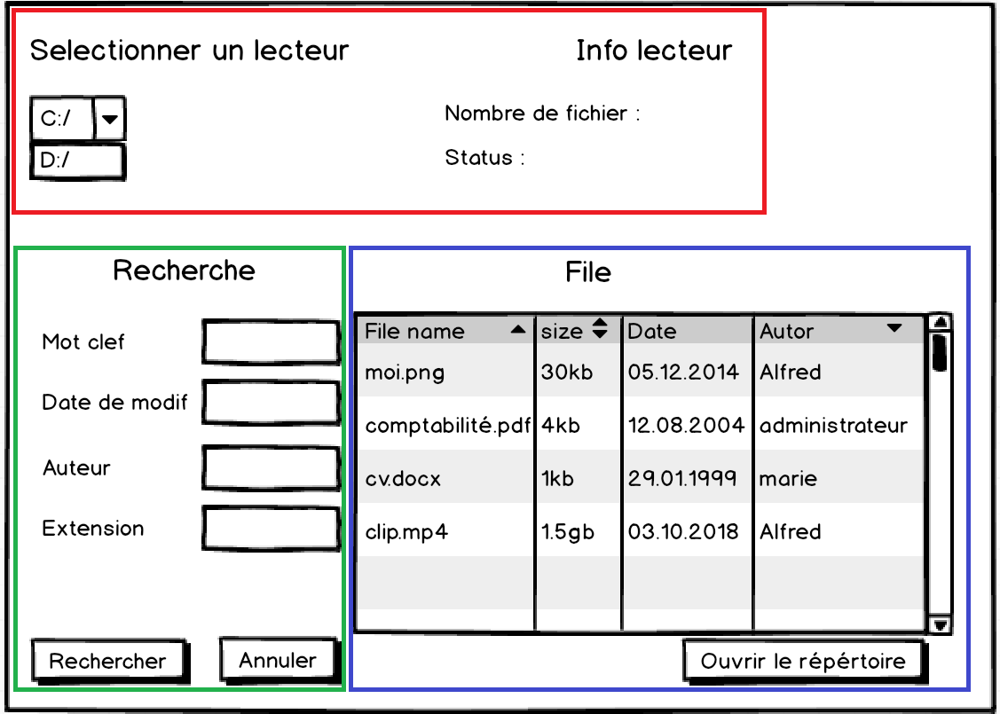
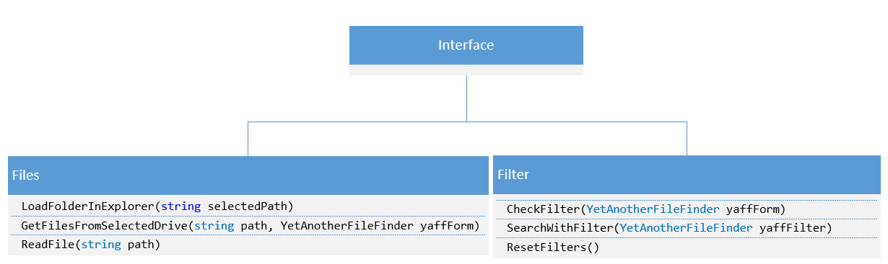

# Conception

## Maquette

La maquette est constituée de 3 grandes parties :

**En rouge** : Les informations concernant le lecteur.

**En vert** : La recherche \(filtre\).

**En bleu** : l'affichage du résultat et l'interaction avec les fichiers.

## Structure / Architecture

La structure de notre application se décompose en 3 parties. l'interface, une classe Files et une classe Filter

### Interface

L'interface définit le formulaire de l'application. C'est avec elle que l'utilisateur interagit.

### Files

Cette classe contiens toutes les fonctions liés aux fichiers

* **LoadFolderInExplorer\(string path\)** : Ouvre les fichier dans l'explorateur Windows avec comme paramètre le chemin du fichier.
* **GetFilesFromSelectedDrive\(string path,YetAnotherFileFinder yaffForm\)** : Permet de charger les fichiers se trouvant dans un dossier ainsi que ces sous-dossiers et de les afficher dans l'interface. La fonction prend comme paramètres "path" qui désigne le chemin d'accès et "yaffForm" qui fait référence à l'interface dans lequel les fichiers vont s'afficher. 
* **ReadFiles\(string path\)** : _\*\*_Ouvre les fichiers avec leur programme par défaut avec comme paramètre le chemin du fichier.

### Filters

* **CheckFilter\(YetAnotherFileFinder yaffForm\)** : Vérifie si un filtre est appliqué.
* **SearchWithFilter\(YetAnotherFileFinder yaffForm\)** : Lance un filtre sur les fichiers.
* **ResetFilters\(\)** : Efface tous les filtres appliqués après une recherche.

## Planning

Le planning du projet est sous forme d'un tableau Trello disponible [ici](https://trello.com/b/jYtXQac9/yet-another-file-finder).

