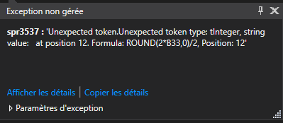

# Réalisation

## Problèmes rencontrés

### Structure globale du projet

Tout au long du projet, on était pas sûr de la structure de notre projet. On a hésité entre plusieurs moyens de faire et on est arrivé à un résultat qui fonctionne mais qui n'est pas le plus optimisé. Celle-ci a été modifié en cours du projet pour satisfaire aux attentes du projet.

### Lecture dans les documents

On a perdu énormément de temps à essayer de lire à l'intérieur des fichiers de la mauvaise manière. On à commencer par utiliser "interop" qui était pas du tout adapter à notre besoin.

On s'est finalement tourné vers des petites librairies qui étaient beaucoup plus simple à utiliser.

### Optimisation

L'optimisation du projet n'a pas été simple à cause de l'implémentation effectuée au début. En effet, l'architecture qu'on avait imaginé n'était pas celle qu'on voulait et nous avons dû changer la structure après tout pour effacer des classes inutiles et réduire la taille du projet. Un autre problème était le temps de chargement de la liste qui prenait plus de 20 à 30 secondes pour plus de 10'000 fichiers. Nous avons réussi à régler le souci avec un workaround qui nous a permis de diviser ce temps de chargement par deux.

### Affichage de l'auteur

Un autre problème qui s'est posé durant le projet est l'auteur. Nous avons essayé de récupérer les méta données pour les auteurs ainsi que les dates. Avec la manière que propose Microsoft, nous n'avons pas eu accès aux méta données et nous avons uniquement l'auteur "Administrateur" si c'est sur le local. Cependant, les fichiers sur un disque réseau affichent le propriétaire du fichier correctement \(avec le domaine de la personne\).

## Bugs restants

### Chemin d'accès trop long

Lorsque le chemin d'accès d'un dossier est plus grand que 255 caractères, l'application plante. C'est une erreur qui vient de Windows et que nous avons pas géré.

#### Solution

L'erreur peut être contourné en évitant d'essayer de lire si le chemin est plus grand que 255 caractères.

### Lecture d'un fichier Excel

Lorsqu'on fait une recherche à l’intérieur d'un fichier Excel. Si le fichier Excel contient une certaine formule, L'application a des chances de planter. Nous n'avons pas géré l'erreur ni à le reproduire correctement.

#### Solution

N'ayant pas eu la chance de reproduire l'erreur, nous avons pas pu analyser entièrement et chercher un fix.

### Les droits sur les fichiers

Certains fichiers sont inaccessibles à cause des droits utilisateurs \(fichiers systèmes\). Ce souci-là n'a pas été géré et peut causer le plantage de l'application.

#### Solution

Si le fichier ne peut pas être accessible, nous passons au fichier suivant à la place de chercher à le mettre dans la liste.

### Sélectionner de nouveau une date sélectionné précédemment avant l'annulation

Si une date a été sélectionnée précédemment et que l'utilisateur veut choisir la même date sur une nouvelle recherche \(c'est à dire après l'annulation\), le calendrier ne le permet pas.

#### Solution

Aucune solution n'a été trouvé à ce jour car nous n'avons pas plus investigué sur le problème.

### Problème avec la police d'écriture

Si la police d'écriture n'est pas installée sur l'ordinateur, le logiciel prend comme police de base Microsoft. Cela cause des problèmes pour les tailles.

#### Solution

Actuellement, nous avons mis à disposition la police mais ce n'est pas très optimale. Nous devons mettre en place la police dans le projet et l'appeler directement. Cependant, nous avons remarqué ce bug que bien tard.

## Améliorations possibles

* Refactorisation de certaines fonctions et/ou classes.
* Ajouter certains type de fichier à la recherche par mot clef comme par exemple : Les powerpoint ou les images.
* Améliorer la rapidité du programme \(Utilisation de LINQ\).
* Le rendre compatible avec MacOS / Linux.
* Régler les bugs actuels. 
* Quand rien n'est à afficher, mettre un pop up pour prévenir qu'il n'y avait rien dans le dossier.
* Désactiver le bouton rechercher pour forcer l'utilisateur à réinitialiser les champs.

