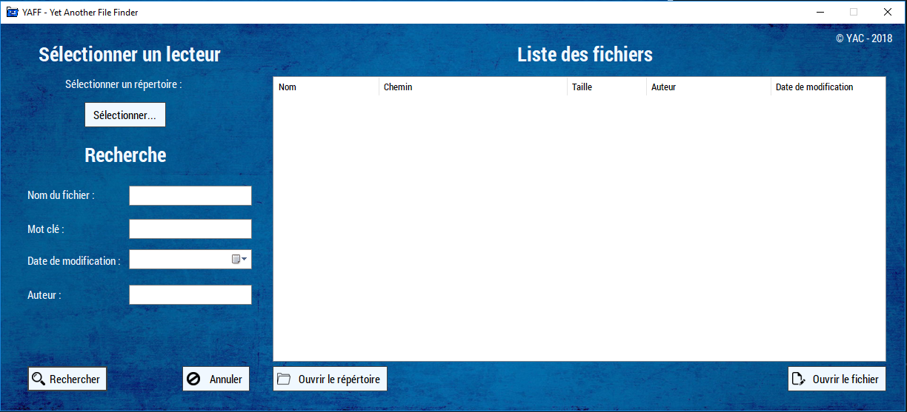
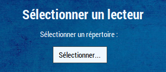
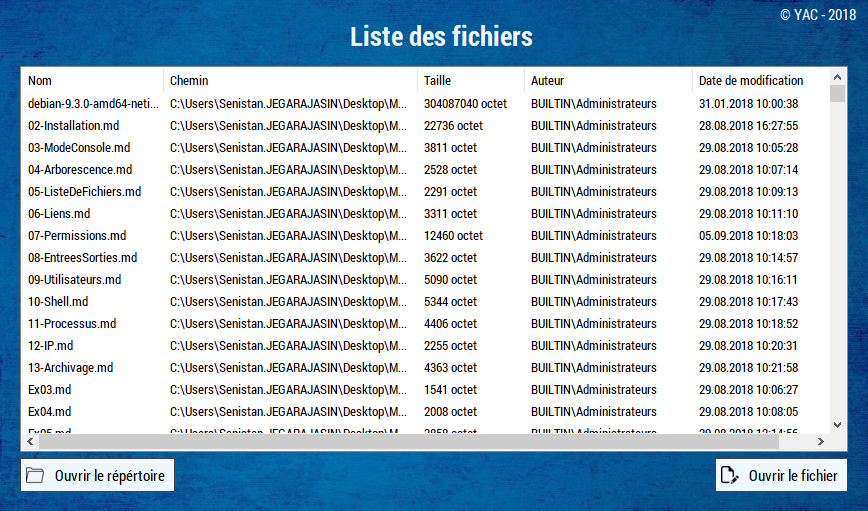

# Utilisation

## Utilisation

### Sélectionner un lecteur

Cliquer sur le bouton "sélectionner" pour sélectionner un lecteur ou un dossier dans le quel vous voulez rechercher un fichier.

### Rechercher

Pour effectuer une recherche , remplissez 1 ou plusieurs champs. Cliquer sur le bouton "Rechercher" . Pour réinitialiser une recherche , appuyer sur le bouton "Annuler"

Le champ "Nom du fichier" permet de rechercher un fichier selon son nom ou son extension . Exemple : "**cv**" ou "**docx**"

Le champ "Mot clé" permet de faire une recherche dans un fichier. les type de fichiers pris en compte sont

* txt
* doc/docx \(word\)
* pdf
* xls/xlsx \(excel\)

Le champ "Date de modification" permet de faire une recherche sur la dernière date de modification d'un fichier

Le champ "Auteur" permet de trouver les fichiers selon leur auteur.

### Interaction avec les fichiers

Une fois un lecteur/dossier sélectionnée ou une recherche effectuée, vous pouvez sélectionner le dossier dans la liste et cliquer sur le bouton "Ouvrir le répertoire" pour ouvrir l'emplacement du fichier dans l'explorateur Windows ou cliquer sur le bouton "Ouvrir le fichier" pour ouvrir le fichier avec son programme par défaut. Par exemple : Microsoft Word pour un fichier "docx".

